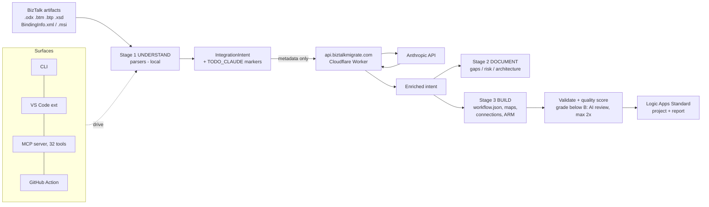

# Technical Due-Diligence Brief — `biztalk-migrate`

**Product:** BizTalk Server → Azure Logic Apps Standard migration tool
**Package:** `biztalk-migrate` (npm), v1.0.70 at time of writing
**Stack:** TypeScript (Node 20, ESM, `strict` + `exactOptionalPropertyTypes`), ~25,700 LOC across 69 source files in `src/`, plus a ~970-LOC Cloudflare Worker in `proxy/`
**Audience:** an acquirer's engineering team. Every claim below is grounded in the repository; file paths are given so you can verify each one.

---

## 1. What the Product Is

A commercial pipeline that parses BizTalk Server artifacts (`.odx` orchestrations, `.btm` maps, `.btp` pipelines, `BindingInfo.xml`, `.xsd` schemas — or an `.msi` export via `src/runner/msi-extractor.ts`) and emits a deployable Logic Apps Standard project: `workflow.json` per orchestration, `connections.json`, `host.json`, XSLT maps, ARM templates, VS Code workspace, C# local-code-function stubs, and an HTML + Markdown migration report.

### Three-stage pipeline

| Stage | Directory | What it does |
|---|---|---|
| 1 — UNDERSTAND | `src/stage1-understand/` (9 files) | Deterministic XML parsing: orchestration/map/pipeline/binding analyzers, complexity scorer, pattern detector, intent constructor |
| 2 — DOCUMENT | `src/stage2-document/` (5 files) | Gap analysis (30+ codified gap definitions), risk assessment, architecture recommendation, migration spec |
| 3 — BUILD | `src/stage3-build/` (9 files) | Workflow/map/connection/infrastructure/test generators, connector catalog, C# translator, package builder |

Stages converge on a single exchange format, **`IntegrationIntent`** (`src/shared/integration-intent.ts`). The greenfield/NLP builder (`src/greenfield/`, Premium tier) produces the same `IntegrationIntent`, so migration and net-new design share one Stage 3 back end. This is also the seam for future source platforms (see §6).

The orchestrating engine is `runMigration()` in `src/runner/migration-runner.ts`. Its own header states the design point precisely: six phases — UNDERSTAND → REASON → SCAFFOLD → BUILD → VALIDATE → REVIEW — where **only REASON and REVIEW call an AI model; everything else runs locally in under a second**. REVIEW is conditional: it runs only when quality grade < B or validation errors exist, capped at 2 iterations.

### Product surfaces

1. **CLI** — `src/cli/index.ts` (commander): `biztalk-migrate run --dir … --app … --output …`, plus `analyze`/`build` subcommands.
2. **VS Code extension** — `src/vscode/extension.ts` registers 8 commands (`analyzeFile`, `analyzeDirectory`, `buildPackage`, `openDashboard`, `startMcpServer`, `createFromNlp`, `listTemplates`, `runMigration`) with webview panels; packaged from `vscode-extension/` via `npm run build:vscode`.
3. **MCP server** — `src/mcp-server/server.ts`, stdio transport. **32 tools** (counted in `src/mcp-server/tools/definitions.ts`), **8 resources** (mapping references, decision trees, and two worked training-pair examples, registered in `server.ts`), and a migration-guide prompt. Any MCP client (Claude Desktop, VS Code, etc.) can drive the full pipeline.
4. **GitHub Action** — `.github/workflows/biztalk-migrate.yml`, `workflow_dispatch`-triggered so consultants run migrations from the Actions UI or `gh` CLI with `BTLA_LICENSE_KEY` as a repo secret. Runs headless on `ubuntu-latest` — no Windows, no Docker.

---

## 2. IP Separation — What Lives Where

The IP is deliberately split in two halves. Both halves stated plainly:

### Server-side (not in this repo, not in the npm package)

The **enrichment system prompts** — the distilled migration methodology used at AI time — exist **only** as Cloudflare Worker secrets and KV. `proxy/src/index.ts` documents the layering:

- Layer 1 ROLE (~1.3 KB) — Cloudflare secret `SYSTEM_PROMPT_ROLE`
- Layer 2 DOMAIN (~18 KB of reference tables) — Cloudflare KV key `domain` (secrets cap at 5.1 KB)
- Layer 3 TASK — secrets `SYSTEM_PROMPT_ENRICH` / `SYSTEM_PROMPT_REVIEW`

Layers 1–2 carry `cache_control: ephemeral` for Anthropic prompt caching (~90% cost reduction on repeat calls, per the Worker's own comments).

**Verification:** `proxy/.gitignore` contains `prompts/*.txt` ("System prompt files contain proprietary domain knowledge — NEVER commit"); `git ls-files proxy/prompts/` returns only `upload.sh`, the deployment script that pushes `role.txt` / `enrich.txt` / `review.txt` / `domain.txt` to Cloudflare. The root `.gitignore` additionally excludes `CLAUDE.md`, `CLAUDE.local.md`, `MIGRATION-PLAN.md`, `docs/reference/`, and `docs/architecture.md` from the public repo/npm package.

### Client-side (ships in the npm package — an acquirer gets this either way)

The **deterministic domain knowledge** is in the client and is substantial on its own:

- **Connector catalog** — `src/stage3-build/connector-catalog.ts` (646 lines): 26 canonical connector entries (azureblob, serviceBus, sap, ibmmq, mllp, cics, ims, hostfile, rabbitmq, …) with real case-sensitive Azure ServiceProvider IDs, required app-setting keys in the `KVS_`/`Common_` naming convention, and a legacy-spelling normalizer. The file header documents the class of deployment-breaking bug it exists to prevent.
- **Intent constructor and Stage 1 analyzers** — `src/stage1-understand/` — the shape→step mapping, XLANG parsing, binding/adapter translation (e.g. WCF-SQL `[dbo].[sp]` → `TypedProcedure/dbo/sp` in `binding-analyzer.ts`).
- **Gap catalog** — `src/stage2-document/gap-analyzer.ts` (946 lines): 30+ codified gap definitions with severity, mitigation text, and per-gap base effort estimates in days.
- **Condensed WDL rules in fallback prompts** — `src/runner/claude-client.ts` embeds two short system prompts (`ENRICHMENT_SYSTEM_PROMPT`, `REVIEW_SYSTEM_PROMPT`, ~10 rules each: runAfter casing, Stateful-only, `@appsetting('KVS_…')`, If-expression object format, Until inversion). These are used **only** in direct/self-hosted mode and are a small subset of the server-side 18 KB domain layer.

**Plain statement of the trade-off:** the deterministic mappings, generators, and validators are fully readable in the shipped client. What a client-only copy cannot reproduce is the layered enrichment prompt stack — that, plus license enforcement, is what the proxy protects.

---

## 3. Data Flow and Privacy Posture

1. **Raw BizTalk XML is parsed locally.** Stage 1 never uploads artifact files. This is asserted in `migration-runner.ts` ("raw XML never leaves the machine — only structural metadata goes to Claude") and borne out by the code: the only network calls in the run path are in `ClaudeClient` and the license validator.
2. **What IS sent to the proxy** (`https://api.biztalkmigrate.com/v1`, Cloudflare Worker, Hono):
   - `POST /v1/enrich` — the full partial `IntegrationIntent` as JSON inside the prompt, plus app name, detected patterns, gap summary. Be aware the intent is *metadata but not anonymous*: it includes connector configuration derived from bindings — container names, queue/topic names, folder paths, endpoint addresses.
   - `POST /v1/review` — the generated `workflow.json` plus validation errors and current quality score (only when grade < B or errors exist).
   - The Worker composes the layered system prompts and forwards to the **Anthropic API** (`proxy/src/anthropic.ts`; model set by the `ANTHROPIC_MODEL` env var). Customer traffic terminates at Anthropic; there is no other third-party data processor in the path besides Cloudflare (and Resend for license emails only).
3. **License validation is a separate lightweight call** — `POST /v1/validate` (`src/licensing/license-validator.ts`: "a single lightweight HTTP call"), returning tier/expiry. Results are cached at `~/.btla/.license-cache`, AES-256-GCM encrypted with a machine-ID-derived key so the cache can't be copied between machines (`src/licensing/license-cache.ts`).
4. **Failure behavior is non-fatal by design:** if enrichment fails, `ClaudeClient.enrich()` returns the partial intent with a warning and the pipeline continues (the quality scorer then penalizes any remaining `TODO_CLAUDE` markers).
5. Worker also hosts monetization endpoints: `/v1/license/trial` (per-IP daily rate-limited trial-key provisioning, keys emailed via Resend) and `/v1/waitlist`. Enrich/review are rate-limited per license and by a global monthly call limit (`proxy/src/rate-limit.ts`).

---

## 4. Licensing and Monetization — As Actually Implemented

Honest description; do not oversell this to yourself.

- **Tiers** (`src/licensing/feature-gates.ts`): `none < free < standard < premium`. Free = Stage 1 + Stage 2; Standard adds Stage 3 build/deploy; Premium adds the greenfield NLP builder and template library.
- **MCP server enforces tier gating**: `src/mcp-server/tools/handler.ts` checks `isFeatureAvailable('build')` before every Stage 3 tool and `isFeatureAvailable('greenfield')` before every Premium tool, returning an upgrade message otherwise. Tier is resolved at server startup via `validateLicense()`.
- **CLI run path validates key presence, not tier**: `src/cli/index.ts` requires one of `BTLA_DEV_MODE`, `ANTHROPIC_API_KEY`, or `BTLA_LICENSE_KEY` to run, and a preAction hook validates the key — but on validation failure it **warns and continues in free tier** rather than hard-failing.
- **The real enforcement point is the proxy**: enrichment/review require a valid license server-side (`proxy/src/auth.ts` Bearer-key middleware against the KV license store). Client-side gates are in shipped JavaScript and are bypassable by a motivated user; what cannot be bypassed is access to the hosted prompt stack.
- **`ANTHROPIC_API_KEY` direct mode exists as a self-hosted path**: `ClaudeClient` (constructor precedence: dev > direct > proxy) calls the Anthropic API directly (model `claude-sonnet-4-6` hardcoded) using the condensed fallback prompts — bypassing both the proxy and license billing. It is documented in the code as "for development and self-hosted deployments" and is also an advertised optional secret in the GitHub Action. An acquirer should treat this as a deliberate escape hatch that trades prompt-stack quality for independence.
- **Dev mode** (`BTLA_DEV_MODE=true`) skips enrichment entirely and defaults the tier to standard — used for offline testing and CI.

---

## 5. Quality Evidence

- **422 tests across 22 suites** (verified: `npx vitest list | wc -l` → 422; suites = 18 unit + 1 integration + 1 golden-master + 2 regression). CI runs the full set.
- **12 fixture sets** (`tests/fixtures/01`–`12`) covering scripting functoids, CBR, call-orchestration, compensation, flat files, a 2-orchestration/6-XSD end-to-end broker, and four fixtures (09–12) derived from real production BizTalk applications (decision branching, complex while loops, custom pipeline components, WCF-SQL bindings).
- **Golden masters** (`tests/golden-master/`) guard *output shape*: a 4-level comparison engine (exact → semantic → topology → mismatch, with runAfter-DAG isomorphism at the topology level) diffs generated `workflow.json`/`connections.json` against checked-in golden files for fixtures 02 and 03.
- **Regression suite** (`tests/regression/`) guards *quality drift*: `quality-baseline.json` pins both golden masters at 90/100 (grade A, 0 errors/0 warnings) with a 2-point regression tolerance, plus vitest snapshots of generated artifacts.
- **Quality scorer** (`src/validation/quality-scorer.ts`) guards *each customer run*: 0–100 across four dimensions (Structural 40 / Completeness 30 / Best Practices 20 / Naming 10), grade A–F, with penalties for unresolved `TODO_CLAUDE` markers, empty SetVariable actions, critical/high gaps, and unimplemented function stubs. The runner targets grade B (≥ 75) and triggers the AI review loop when below it.
- **CI gates** (`.github/workflows/ci.yml`, on push/PR to main/develop, Node 20): TypeScript compile check (`tsc --noEmit`), ESLint, full test run (`npm test` = `vitest run`), an explicit golden-master run, an explicit regression run, then build. `prepublishOnly` re-runs clean + test + build before any npm publish.

---

## 6. Competitive Position

**vs. Microsoft's free BizTalk migration tooling (Copilot-based Migration Agent / Azure Logic Apps "accelerator" path):**

- **Deterministic core.** Parsing, gap analysis, generation, and validation are conventional code with a fixed test suite — the AI touches exactly two phases and its output is re-validated and re-scored. Chat-agent approaches make the model the whole pipeline.
- **CI-runnable and headless.** The GitHub Action runs on stock `ubuntu-latest` with Node 20 — no Copilot license, no Docker image, no Windows host, no IDE session. Migrations become reviewable pull requests.
- **Quality scoring as a gate**, not vibes: a numeric grade with dimension breakdown, golden-master comparison, and a regression baseline. Microsoft's tooling produces output; it does not grade itself.
- **MCP-native**: 32 tools mean any agent stack (not just Copilot) can drive it, including an acquirer's own products.
- **The counterweight is honest:** Microsoft's tool is free and first-party. This product competes on repeatability, auditability, quality gates, and consultant workflow — not on price.

**vs. BizTalkMigrationStarter-style community kits:** those are scaffolding/templates requiring manual translation of every orchestration; this is an end-to-end parser-to-package pipeline with tests and scoring.

**Market window:** per Microsoft's published lifecycle, BizTalk Server 2020 mainstream support ends April 12, 2028 and extended support ends April 10, 2030. Every remaining BizTalk estate must land somewhere within that window; Logic Apps Standard is Microsoft's designated destination.

**Expansion path:** the architecture's convergence format, `IntegrationIntent`, is source-platform-agnostic — the greenfield NLP builder already produces it without any BizTalk input, proving Stage 3 stands alone. A MuleSoft (or webMethods/TIBCO) Stage 1 parser feeding the same Stage 2/3 is the natural expansion. **To be clear: no MuleSoft code exists in the repository today** — this is a roadmap claim about the architecture, not shipped capability.

---

## 7. Known Limitations (read `src/stage2-document/gap-analyzer.ts` for the full catalog)

The tool codifies its own limits as ~30+ gap definitions with severity and effort estimates; it reports them rather than hiding them. The material ones:

- **Scripting functoids are not auto-converted when they contain code.** Inline-XSLT functoids port verbatim (low severity), but Inline C#/VB.NET/JScript.NET and external-assembly functoids compile to `msxsl:script` blocks that fail at runtime in Logic Apps' XSLT engine — the tool flags them (high severity, ~3 base effort days each) and generates local-code-function stubs, but a human writes the rewrite. Third-party compiled-DLL functoids (IDs ≥ 10000) are flagged with no source available.
- **EDI/B2B partner configuration is not auto-migrated.** X12/EDIFACT/AS2 map to Integration Account encode/decode actions, but the Integration Account itself, schema uploads, and trading-partner agreements are manual — and the gap text flags Integration Account cost (~$300–$1,000/month) explicitly.
- **Correlation sets / sequential convoys / aggregators get guidance, not automation.** Flagged high severity with a documented Service Bus CorrelationId pattern (~4 base effort days); the tool does not generate the aggregation workflow.
- **No-equivalent BizTalk features require redesign**, and are reported as such: MSDTC atomic transactions and Compensate (saga/compensation pattern), WCF-NetNamedPipe (no Azure equivalent at all), Suspend, BRE rule sets, BAM dashboards, custom pipeline components (per-component analysis), flat-file pipeline output differences, multiple activating receives.
- **Enrichment quality is model-dependent and failure is soft:** if the AI call fails or returns unusable JSON, the run completes on the partial intent and remaining `TODO_CLAUDE` markers surface in the report and depress the quality grade — correct behavior, but it means not every run is deploy-ready without review.
- **Golden masters cover 2 of 12 fixtures** (02, 03); the others are covered by unit/regression/snapshot tests but not byte-level masters.

---

*Prepared from repository state on branch `sale/buyer-brief` (based on main @ f7029aa, v1.0.70). All counts reproduced by commands cited inline.*
